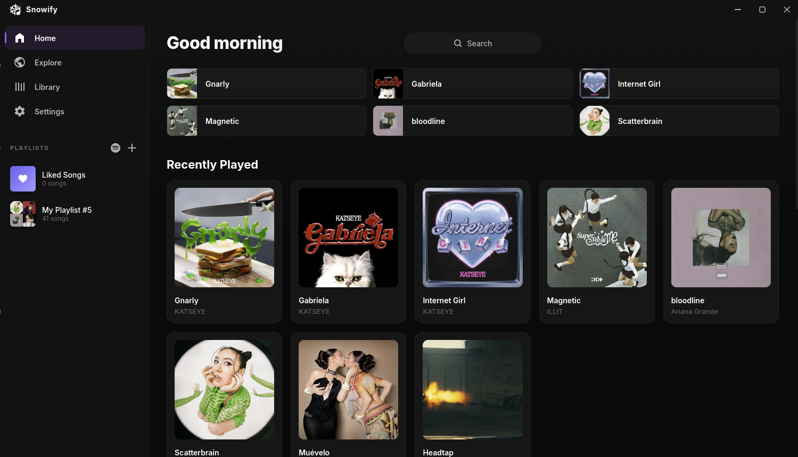
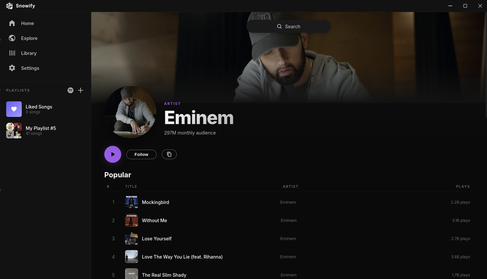
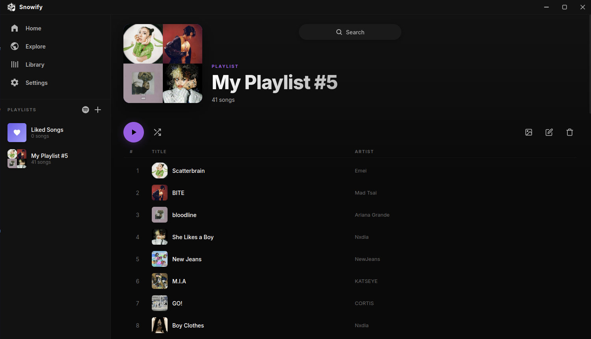
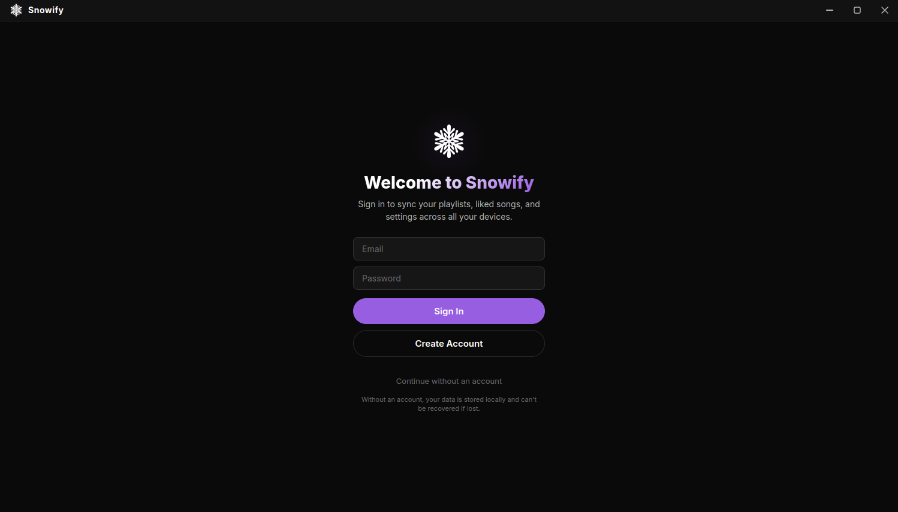
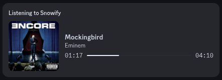

# [Snowify](https://nyakuoff.github.io/Snowify-Website/)

A desktop music player built with Electron that streams audio from YouTube Music. Clean UI, no accounts, no ads.

> [!WARNING]
> This is a **Beta version** of the app. It's still a work in progress and may contain bugs or unfinished features, use at your own discretion.

## Features

- **Search** — Find songs, artists, and albums via YouTube Music
- **Playback** — Stream audio directly with play/pause, seek, skip, volume
- **Queue** — View and manage upcoming tracks, drag reorder
- **Smart Queue** — Auto-fills with similar songs when the queue runs out
- **Shuffle & Repeat** — Shuffle queue, repeat one or all
- **Playlists** — Create, rename, delete, and add/remove tracks. Custom or auto-generated covers. Drag & drop songs into sidebar playlists
- **Liked Songs** — Heart any track to save it
- **Synced Lyrics** — Spotify-like synced lyrics from multi-source
- **Artist Pages** — Top songs, discography, monthly audience, fans also like, and live performances
- **Follow Artists** — Follow artists and see their recent releases on the home page
- **Music Videos** — Watch music videos in-app
- **Discord Rich Presence** — Show what you're listening to on Discord
- **Cloud Sync** — Sign in with email to sync your library across devices
- **Themes** — Built-in color themes
- **Keyboard Shortcuts** — Full keyboard control (see below)

## Screenshots

| | |
|---|---|
|  |  |
|  |  |
|  |  |

## Getting Started

You'll need [Node.js](https://nodejs.org/) (v18+) and [yt-dlp](https://github.com/yt-dlp/yt-dlp) installed on your system.

```bash
# Clone the repo
git clone https://github.com/nyakuoff/Snowify.git
cd snowify

# Install dependencies
npm install

# Run
npm start
```

### Requirements

| Dependency | Purpose |
|---|---|
| [Electron](https://www.electronjs.org/) | Desktop app shell |
| [ytmusic-api](https://github.com/sigmundgranaas/ytmusic-api) | YouTube Music search, artist & album data |
| [yt-dlp](https://github.com/yt-dlp/yt-dlp) | Extracts audio stream URLs (must be in PATH) |
| [synclyrics](https://github.com/Stef-00012/SyncLyrics) | Synced lyrics from Musixmatch, LrcLib, Netease |
| [Firebase](https://firebase.google.com/) | Authentication & cloud sync |

## Keyboard Shortcuts

| Key | Action |
|---|---|
| `Space` | Play / Pause |
| `←` / `→` | Seek backward / forward 5s |
| `Ctrl+←` / `Ctrl+→` | Previous / Next track |
| `↑` / `↓` | Volume up / down |
| `/` | Focus search |

## Tech Stack

- **Electron** — Desktop framework
- **ytmusic-api** — YouTube Music metadata
- **yt-dlp** — Audio stream extraction
- **synclyrics** — Synced lyrics (Musixmatch, LrcLib, Netease)
- **Firebase** — Auth & Firestore cloud sync
- **Discord RPC** — Rich presence integration

## Roadmap

- [x] Song recommendations
- [x] Smart queue — auto-fills with similar songs when not playing an album/playlist and the queue runs out
- [x] Lyrics page with synced lyrics (Spotify-like)
- [x] Drag and drop songs into playlists
- [x] Discord RPC
- [x] Follow Artist feature
- [ ] Upcoming Releases from followed artists
- [x] Recent Releases from followed artists
- [x] Watch Music Videos in-app
- [x] Spotify playlists migration support
- [x] "Fans might also like" section in artists page
- [x] Monthly audience stat per artist
- [x] Cloud sync
- [x] User accounts
- [x] Multi-source lyrics (Musixmatch, LrcLib, Netease)
- [x] Watch Live Performances in-app

## Legal

This app is for **personal and educational use only**. It streams content from publicly available sources. I am not responsible for how anyone chooses to use it.

## Contributing

If you find bugs, have ideas, or want to clean something up, feel free to open an issue or a PR. All skill levels welcome.

> [!NOTE]
> **AI Disclaimer**: Parts of this project were assisted or written by AI. If that's something you're not comfortable with, no hard feelings, I understand and I don't force anyone to use it. The code may have flaws. If you spot something that could be better, contributions are very welcome. I'm still learning and would appreciate the help.
